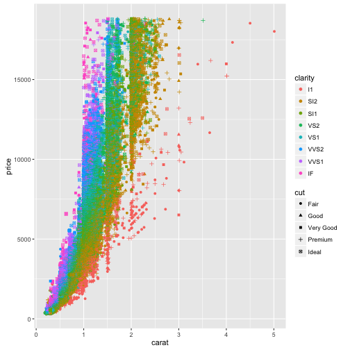

## A quick plot

Carat, clarity and cut are good predictors, and should be easy to fit a linear model.



---

## The model

We fit the following model, taking into account relationship between carat and price:

```
lm((log(price)) ~ I(carat^(1/3)) + carat + cut + clarity, data = diamonds)
```

---

## The Result

[https://spli.shinyapps.io/DiamondPricer/]

Please click and give it a go!

